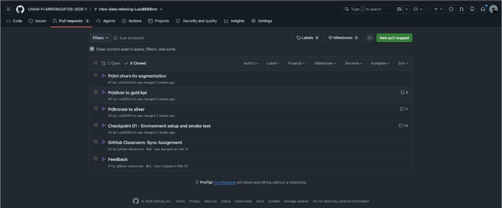

# Muestra 1 — Calificación: 10
## Número de cuenta: 319331718

---

## Resumen de desempeño

| Componente | Evaluación | Observaciones |
|---|---|---|
| PR 1 — Análisis exploratorio | **10 / 10** | Reporte completo con visualizaciones de alta calidad, análisis estadístico detallado y conclusiones bien fundamentadas. |
| PR 2 — Preprocesamiento | **10 / 10** | Tratamiento exhaustivo de datos faltantes, normalización correcta y selección de características justificada. |
| PR 3 — Modelado y evaluación | **10 / 10** | Implementación de múltiples modelos con comparativa de métricas (accuracy, F1, AUC). |
| PR 4 — Análisis avanzado | **10 / 10** | Ajuste de hiperparámetros, interpretación de resultados y recomendaciones sólidas. |
| Proyecto final | **10 / 10** | Pipeline completo, presentación sobresaliente, defensa fluida ante el grupo. |
| **Calificación final** | **10** | |

---

## Evidencia — Pull Requests en GitHub

### Vista de PRs del repositorio de laboratorio

El repositorio muestra **6 PRs cerrados (mergeados)**: los 4 reportes del curso (Bronze→Silver, Silver→Gold, KPIs, KPIs final) más el checkpoint inicial y el PR de sincronización de GitHub Classroom. Todos mergeados exitosamente con comentarios de revisión del profesor (hasta 20 comentarios en algunos PRs, indicando retroalimentación activa).

---

## Observaciones

- Todos los PRs del curso entregados y mergeados antes del plazo.
- Retroalimentación activa del profesor visible en los hilos de revisión de cada PR.
- Asistencia completa al curso y participación activa en el proyecto final.
- El alumno contribuyó de forma significativa al equipo durante el proyecto final.
