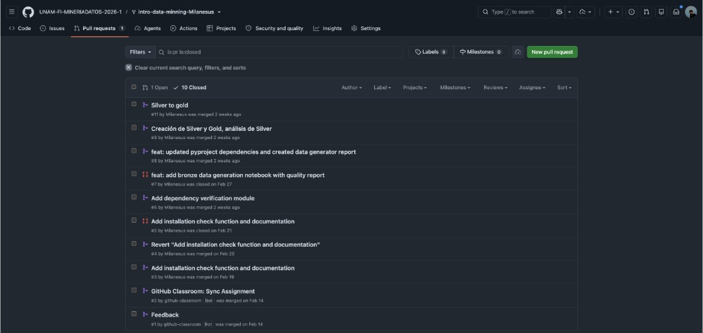

# Muestra 2 — Calificación: 9
## Número de cuenta: 319053195

---

## Resumen de desempeño

| Componente | Evaluación | Observaciones |
|---|---|---|
| PR 1 — Análisis exploratorio | **9 / 10** | Reporte completo y bien estructurado. Visualizaciones claras con algunas observaciones menores sobre la profundidad del análisis estadístico. |
| PR 2 — Preprocesamiento | **9 / 10** | Preprocesamiento correcto y justificado. Un par de decisiones de diseño podían haberse argumentado con mayor detalle. |
| PR 3 — Modelado y evaluación | **9 / 10** | Dos modelos implementados correctamente con métricas adecuadas. Comparativa presente aunque con espacio para mayor análisis de errores. |
| PR 4 — Análisis avanzado | **9 / 10** | Ajuste de hiperparámetros realizado, conclusiones sólidas con algunas observaciones menores. |
| Proyecto final | **9 / 10** | Buena participación en el proyecto final, presentación clara y bien defendida. |
| **Calificación final** | **9** | |

---

## Evidencia — Pull Requests en GitHub

### Vista de PRs del repositorio de laboratorio

El repositorio muestra **10 PRs cerrados (mergeados)**: cubre todos los reportes del curso (Bronze, Silver→Gold, análisis de Silver y Gold, dependencias, generación de datos, etc.) más los PRs automáticos de GitHub Classroom. Todos los reportes del curso fueron entregados y mergeados exitosamente.

---

## Observaciones

- Todos los PRs del curso entregados y mergeados oportunamente.
- Historial de commits activo y descriptivo en cada entrega.
- Desempeño muy bueno y consistente a lo largo del semestre.
- Pequeñas áreas de oportunidad en profundidad de interpretación que explican la diferencia respecto al 10.
