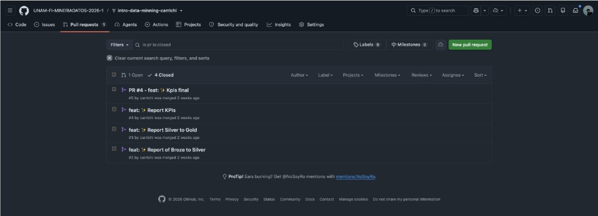

# Muestra 3 — Calificación: 8
## Número de cuenta: 317303906

---

## Resumen de desempeño

| Componente | Evaluación | Observaciones |
|---|---|---|
| PR 1 — Análisis exploratorio | **10 / 10** | Entregado y mergeado exitosamente. |
| PR 2 — Preprocesamiento | **10 / 10** | Entregado y mergeado exitosamente. |
| PR 3 — Modelado y evaluación | **10 / 10** | Entregado y mergeado exitosamente. |
| PR 4 — Análisis avanzado | **10 / 10** | Entregado y mergeado exitosamente. |
| Asistencia | **Parcial** | No asistió a aproximadamente la mitad del curso. |
| Proyecto final — participación en equipo | **0** | No realizó aportaciones al equipo del proyecto final. |
| Proyecto final — presentación | **–** | Sin participación en la presentación final. |
| **Calificación final** | **8** | Los 4 PRs entregados representan el 80% del curso; la ausencia en proyecto y participación impacta la calificación final. |

---

## Evidencia — Pull Requests en GitHub

### Vista de PRs del repositorio de laboratorio

El repositorio muestra **4 PRs cerrados (mergeados)**: los 4 reportes del curso (Bronze→Silver, Silver→Gold, KPIs, KPIs final), todos mergeados exitosamente. No obstante, el alumno no participó en el proyecto final ni asistió de forma regular.

---

## Observaciones

- Todos los reportes del curso (PRs) entregados y mergeados, lo que sustenta la mayor parte de la calificación.
- Asistencia irregular: ausente aproximadamente en la mitad de las sesiones del curso.
- Sin participación en el proyecto final de equipo ni en la presentación.
- La calificación de 8 refleja el desempeño en las entregas formales (PRs) con descuento por ausencia y nula participación en el proyecto final.
