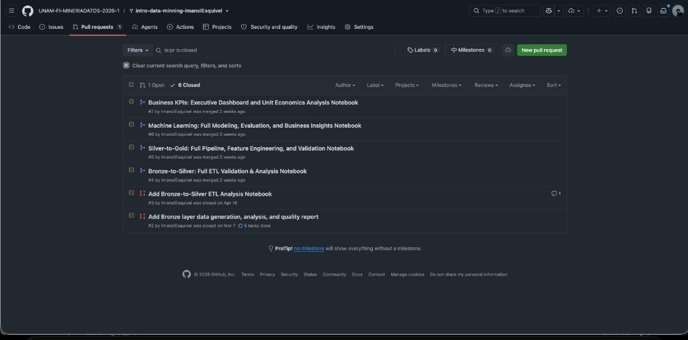

# Muestra 4 — Calificación: 8
## Número de cuenta: 319590139

---

## Resumen de desempeño

| Componente | Evaluación | Observaciones |
|---|---|---|
| PR 1 — Análisis exploratorio (Bronze layer) | **8 / 10** | Entregado. Algunos PRs intermedios cerrados sin merge; la versión final fue mergeada. |
| PR 2 — Preprocesamiento (Bronze→Silver) | **8 / 10** | Entregado y mergeado. Pipeline ETL de validación y análisis completo. |
| PR 3 — Modelado y evaluación (Silver→Gold) | **8 / 10** | Feature engineering y validación entregados y mergeados. |
| PR 4 — Análisis avanzado (Machine Learning / KPIs) | **8 / 10** | Modelado completo, evaluación y KPIs entregados y mergeados. |
| Participación en proyecto final | **8 / 10** | Participación correcta en el proyecto final. |
| **Calificación final** | **8** | |

---

## Evidencia — Pull Requests en GitHub

### Vista de PRs del repositorio de laboratorio

El repositorio muestra **6 PRs cerrados**: los 4 reportes del curso entregados (Bronze layer, Bronze→Silver, Silver→Gold, Machine Learning/KPIs, KPIs Executive Dashboard) más PRs de apoyo. Todos los reportes principales fueron mergeados exitosamente.

---

## Observaciones

- Todos los reportes del curso entregados y mergeados.
- Historial de PRs activo con iteraciones y correcciones visibles (algunos PRs cerrados sin merge corresponden a versiones preliminares que se rehacieron).
- Desempeño bueno y consistente; las áreas de oportunidad en calidad del análisis explican la diferencia respecto al 10.
