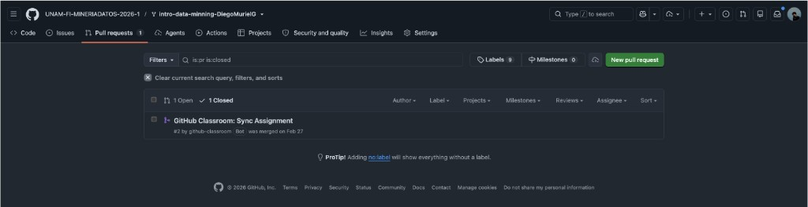

# Muestra 5 — Calificación: 7
## Número de cuenta: 319171053

---

## Resumen de desempeño

| Componente | Evaluación | Observaciones |
|---|---|---|
| PR 1 — Análisis exploratorio | **0 / 10** | No entregado. |
| PR 2 — Preprocesamiento | **0 / 10** | No entregado. |
| PR 3 — Modelado y evaluación | **0 / 10** | No entregado. |
| PR 4 — Análisis avanzado | **0 / 10** | No entregado. |
| Asistencia y participación en clase | **Completa** | Asistió regularmente al curso a lo largo del semestre. |
| Proyecto final — participación en equipo | **Mínima** | No contribuyó activamente al equipo del proyecto final. |
| Proyecto final — presentación | **Sí** | Se presentó en la defensa final del proyecto. |
| **Calificación final** | **7** | Crédito otorgado por asistencia, participación en clase y presentación del proyecto final. |

---

## Evidencia — Pull Requests en GitHub

### Vista de PRs del repositorio de laboratorio

El repositorio muestra únicamente **1 PR cerrado**, correspondiente al sincronización automática generada por GitHub Classroom Bot al momento de la asignación. **No se entregó ningún reporte de curso** como Pull Request.

---

## Observaciones

- Esta muestra representa la calificación más baja del grupo con nota aprobatoria.
- El alumno no entregó ninguno de los 4 reportes (PRs) del curso.
- A pesar de lo anterior, el alumno asistió regularmente a clases, participó en las sesiones y se presentó en la defensa del proyecto final, lo que justifica la calificación aprobatoria mínima.
- Caso representativo de un alumno con presencia y disposición pero sin entregas formales en el repositorio.
